# Example Widgets

Example widgets demonstrating ranma's capabilities. Each example can be used as an init script:

```sh
ranma-server start --init ./examples/<name>/init
```

You can also run an init script directly while ranma-server is already running, to add widgets to the existing session:

```sh
./examples/<name>/init
```

All examples require [reap](https://github.com/typester/reap) (`brew install typester/reap/reap`) for process lifecycle management.

---

## Unified

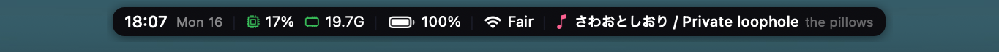

A single combined status bar containing clock, CPU/memory, battery, Wi-Fi, now playing, and mic/camera indicators. All data is managed by one widget process with staggered update intervals.

**Prerequisites:** Python 3, Swift (Xcode CLT)

---

## Island

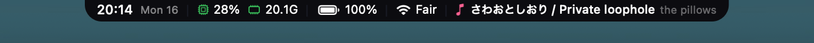

Dynamic Island style variant of the unified bar. Attaches to the top edge of the screen with only the bottom corners visible, mimicking Apple's Dynamic Island appearance. Designed for non-notch displays.

**Prerequisites:** Python 3, Swift (Xcode CLT)

---

## Unified Style Variants

The following are style variants of the unified bar. Same functionality, different visual themes.

### Unified Light

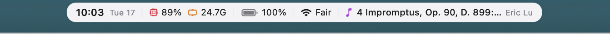

Light minimal theme with white/gray background and dark text. Clean, modern design inspired by native macOS aesthetics. Features thin borders and subtle shadows.

**Prerequisites:** Python 3, Swift (Xcode CLT)

### Unified Neon

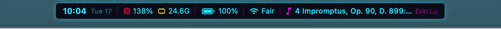

Cyberpunk-inspired theme with a deep dark background, cyan/magenta neon accents, and glowing borders. Sharp corners with vibrant neon color scheme.

**Prerequisites:** Python 3, Swift (Xcode CLT)

### Unified Retro

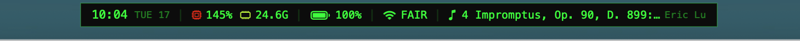

Retro terminal/hacker theme with black background, phosphor green monospace text (Menlo), and sharp corners. No shadows. Labels display in uppercase for an authentic CRT feel.

**Prerequisites:** Python 3, Swift (Xcode CLT)

### Unified Pastel

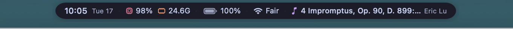

Soft dark theme inspired by the [Catppuccin Mocha](https://github.com/catppuccin/catppuccin) color palette. Deep purple background with pastel accent colors (green, peach, mauve). Pill-shaped with large corner radius and dot separators.

**Prerequisites:** Python 3, Swift (Xcode CLT)

### Unified Transparent


Fully transparent theme that blends seamlessly with the macOS menu bar. No background, no borders, no custom font or colors — uses system defaults for everything. Only status indicators (CPU load, battery, etc.) use explicit colors. Designed for macOS Tahoe's transparent menu bar.

**Prerequisites:** Python 3, Swift (Xcode CLT)

---

## Image Feature Demos

The following examples demonstrate ranma's image rendering capabilities (`--image`, `--image-scale`, tiling).

### Progress Bar

CPU usage visualized as a tiling progress bar. A 1px-wide solid-color PNG is tiled across a variable width proportional to CPU usage. Color-coded: green (normal), orange (moderate), red (high). Updates every 2 seconds.

**Prerequisites:** Python 3

### Pixel Runner

Animated pixel-art character in the status bar. Four 7×8 pixel-art frames are generated at startup and cycled at ~150ms intervals to create a running animation. Demonstrates frame-by-frame `--image` updates with `--image-scale` for crisp pixel art.

**Prerequisites:** Python 3

---

## All

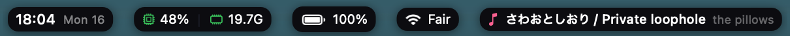

Launches all individual widgets simultaneously. Each widget creates its own separate container, displayed as individual pills on the menu bar.

**Prerequisites:** Python 3, Swift (Xcode CLT)

---

## Individual Widgets

The following widgets can be used standalone or combined via the `all` example.

### Clock

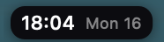

Displays current time (HH:MM) and day/date. Updates every second.

**Prerequisites:** Python 3

### CPU & Memory

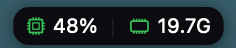

Real-time CPU usage percentage and memory consumption in GB. Color-coded icons: green (normal), orange (moderate), red (high). Updates every 5 seconds.

**Prerequisites:** Python 3

### Battery

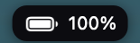

Battery level with SF Symbol icon that changes based on charge level and charging state. Color indicates status: green (charging), orange (low), red (critical). Updates every 30 seconds.

**Prerequisites:** Python 3

### Wi-Fi

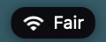

Wi-Fi signal strength indicator. Displays signal quality (Strong/Fair/Weak) with color-coded icon. Updates every 10 seconds.

**Prerequisites:** Python 3, Swift (Xcode CLT)

### Now Playing

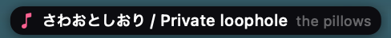

Currently playing media title and artist from any macOS media source. Automatically hides when nothing is playing. Updates every 3 seconds.

**Prerequisites:** Python 3, Swift (Xcode CLT)

### Mic & Camera

Privacy indicator that appears when the microphone or camera is actively in use. Camera shows a green icon, microphone shows an orange icon. Automatically hides when neither is in use. Updates every 2 seconds.

**Prerequisites:** Python 3, Swift (Xcode CLT)

---

## Yashiki Workspace

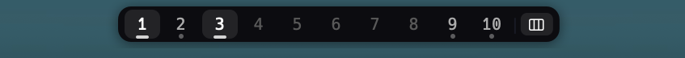

Workspace indicator for the [yashiki](https://github.com/typester/yashiki) tiling window manager. Displays workspace tags (1-10) per display with visual states for active, occupied, and vacant workspaces. Updates in real-time via yashiki event subscription.

**Prerequisites:** Python 3, yashiki, Hack Nerd Font (`brew install --cask font-hack-nerd-font`)
